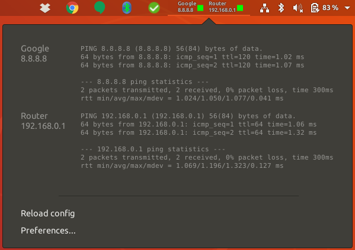
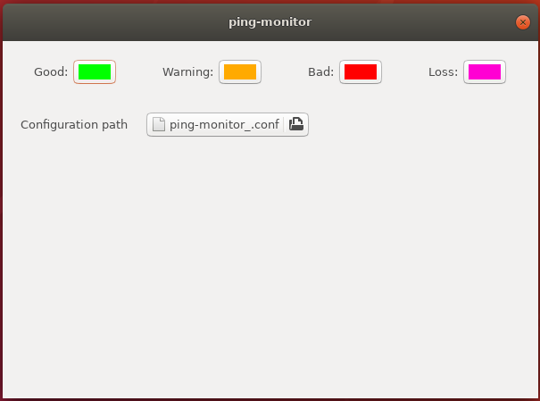

## Gnome shell ping monitor extension

This is still in development and just an alpha version.





### Installation

#### Prerequisites

This extension [requires GNOME Shell v3.4 or later](https://github.com/anybotics/gnome-shell-ping-monitor-applet/blob/master/ping-monitor%40samuel.bachmann.gmail.com/metadata.json#L2).

Before installing this extension, ensure you have the necessary system packages installed:

* On Ubuntu:

      $ sudo apt-get install gir1.2-gtop-2.0 gir1.2-clutter-1.0

* On Fedora:

      $ sudo yum install --assumeyes libgtop2-devel
    
* On openSUSE (Leap 42.1):

      $ sudo zypper install gnome-shell-devel libgtop-devel libgtop-2_0-10

For the browser installation (recommended), you will need the GNOME Shell integration browser extension for
[Chrome](https://chrome.google.com/webstore/detail/gnome-shell-integration/gphhapmejobijbbhgpjhcjognlahblep),
[Firefox](https://addons.mozilla.org/en-US/firefox/addon/gnome-shell-integration/) or
[Opera](https://addons.opera.com/en/extensions/details/gnome-shell-integration/).

> Note: If you're using Firefox 52 or later, [you will also need to install `chrome-gnome-shell`](https://blogs.gnome.org/ne0sight/2016/12/25/how-to-install-gnome-shell-extensions-with-firefox-52/).
The instructions are available [on the GNOME wiki](https://wiki.gnome.org/Projects/GnomeShellIntegrationForChrome/Installation#Ubuntu_Linux).

> Note: If you're using Gnome 3.2 checkout the branch `gnome-3.2`.

#### Browser installation

It's recommended you install the extension via the Gnome Shell Extensions website.

Visit [this extension's page on extensions.gnome.org](https://extensions.gnome.org/extension/1607/ping-monitor/),
preferably in Firefox, and install by clicking the toggle button next to the extension's name.

If the install was successful, the toggle button should now show "ON".
If it failed, ensure that you installed all the [necessary dependencies](#prerequisites),
and that you granted the browser permission to install extensions when prompted.
Additionally, rebooting gnome-shell may help (type `Alt + F2` and input `r` in the prompt).

#### Manual installation

[Download the ZIP/Tarball](https://github.com/anybotics/gnome-shell-ping-monitor-applet/releases),
extract the archive, open a shell into its directory, and run:

    make install

Alternately, if you plan on doing development on the extension, or testing modifications, it's advised you checkout the Git repository and install a symlink. First, install git if you don't have it: (sudo apt-get install git-core, sudo pacman -S git, etc), then run:

    mkdir ~/git
    cd ~/git
    git clone git://github.com/anybotics/gnome-shell-ping-monitor-applet.git    
    mkdir -p ~/.local/share/gnome-shell/extensions
    cd ~/.local/share/gnome-shell/extensions
    ln -s ~/git/gnome-shell-ping-monitor-applet/ping-monitor@samuel.bachmann.gmail.com
    gnome-shell-extension-tool --enable-extension=ping-monitor@samuel.bachmann.gmail.com

And restart gnome-shell (`Alt + F2`, then `r`) or reboot the machine.

On openSUSE you need to install a devel package that provides the `gnome-shell-extension-tool` command:

    $ sudo zypper install gnome-shell-devel


### Configuration

At the moment you need a manual config file. Create a file `~/.config/ping-monitor.conf` with e.g.:

```
{
  "debug_output": false,
  "ping_config": [
    {
      "tag": "google",
      "name": "Google",
      "address": "8.8.8.8",
      "ping_count": 2,
      "ping_interval": 0.3,
      "ping_deadline": 3,
      "refresh_interval": 2000,
      "active": true,
      "visible": true,
      "show_name": true,
      "show_address": true,
      "show_tooltip": true,
      "warning_threshold": 20
    },
    {
      "tag": "router",
      "name": "Router",
      "address": "192.168.0.1",
      "ping_count": 2,
      "ping_interval": 0.3,
      "ping_deadline": 3,
      "refresh_interval": 2000,
      "active": true,
      "visible": true,
      "show_name": true,
      "show_address": true,
      "show_tooltip": true,
      "warning_threshold": 20
    }
  ]
}
```

Make sure that you define all variables.

To load a new config you need to restart Gnome-Shell: `Alt + F2` then `r` and `Enter`.

### Development

#### Deployment

To create a zip file with the specified version number, ready to upload to [Gnome Shell Extensions](https://extensions.gnome.org/) or similar repository, run:

    make zip-file VERSION=<version>

To determine the version number to use, check the extensions site and increment from the largest published version.

The specified version number is just for documentation and isn't strictly necessary in the uploaded file, since the extensions website will dynamically set this and override whatever we enter.

Once uploaded, [create a Github release](https://github.com/anybotics/gnome-shell-ping-monitor-applet/releases) with the same version number.

### Authors

[samuelba](https://github.com/samuelba)

I took the [gnome-shell-system-monitor-applet](https://github.com/paradoxxxzero/gnome-shell-system-monitor-applet) and wrote my ping applet on top of it.

### License

Copyright (C) 2019 Samuel Bachmann aka samuelba

This program is free software: you can redistribute it and/or modify
it under the terms of the GNU General Public License as published by
the Free Software Foundation, either version 3 of the License, or
(at your option) any later version.

This program is distributed in the hope that it will be useful,
but WITHOUT ANY WARRANTY; without even the implied warranty of
MERCHANTABILITY or FITNESS FOR A PARTICULAR PURPOSE.  See the
GNU General Public License for more details.

You should have received a copy of the GNU General Public License
along with this program.  If not, see <http://www.gnu.org/licenses/>.
